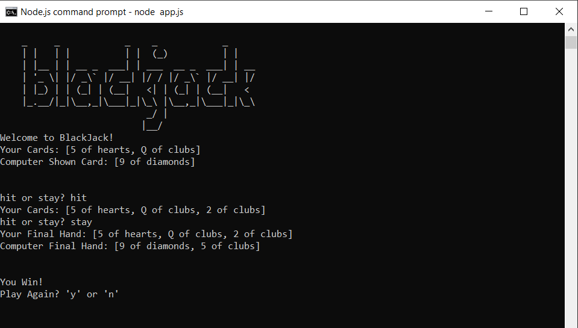

# 100 Days of Code - Day 11 - Blackjack

# Prompt

Write a program that has the following console features:

* Write a functional BlackJack Game
* Display ASCII art related to Blackjack.
* Show the player their starting cards.
* Show the player the computer's top card
* Ask the user if they would like to hit or stay
* if the user decides to hit, add another card to their hand.
* if the hand exceeds the value of 21, the player loses
* the player/computer with the higher score wins.

# Example

* No example provided. See blackjack game rules for details

# Screenshot of Working Solution

